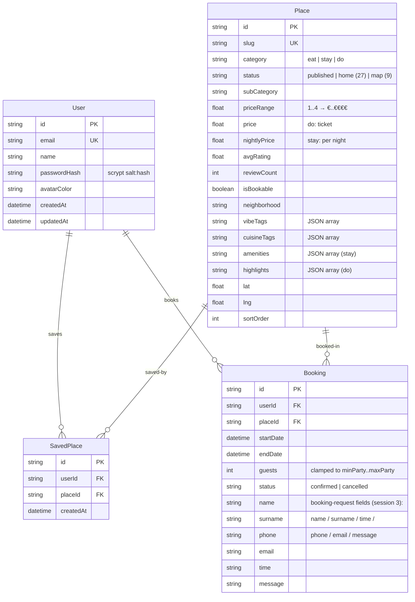

# ROAM (Augsburg City Guide) — Master Project Architecture Document (PAD) v1.0

**Classification:** Internal Engineering Reference
**Status:** DEFINITIVE, PRODUCTION-LOCKED BLUEPRINT
**Companion Documents:** `README.md` (user-facing), `AGENTS.md` (compact operator file), `CLAUDE.md` (agent conventions), `docs/DEPLOYMENT.md` (production runbook), `docs/Tailwind-V4-Validation-Report.md` (v4 findings)
**Last Updated:** 2026-09-23
**Audience:** Senior Engineers, Tech Leads, DevOps, and Onboarding Engineers
**Rule:** Every architectural decision in this document traces to a specific rationale. Nothing is here "because it's popular."

#### Revision Block — v1.0 (Tracked Changes)

- `[SYN]` Initial PAD for the completed ROAM clone — generated after all verification gates passed (lint ✓, typecheck ✓, 32 unit ✓, 27 E2E ✓, 27 smoke ✓).
- `[v1.1]` Session 2 remediation — live-app parity pass (Libre Baskerville/Poppins fonts, image logo, glass planner hero, home showcase: Recommended Route / blue Highlighted Restaurants / Choose Your Vibe stays / Highlighted Sights / footer + legal pages; `status:"home"` seeding; env pinning on db scripts). Gates re-verified: 32 unit ✓, 27 smoke ✓, 35 E2E ✓.
- `[v1.2]` Session 3 remediation — live-app re-measure (14 findings, `docs/remediation-plan-session-3.md`): palette `#F8F7F4/#0E0E0E/#571AFF` + new line/border/muted tokens; Poppins dropped (nav → Inter); navbar redesigned (mobile cream-glass fixed-top tab-bar / desktop flat white `h-14` bar); shared TripPlanner + DateRangePicker routing into browses with `people`/`start_date`/`end_date` params; sticky scroll Recommended Route with progress pill; eat/do/stay card redesigns (overlaid names, active+dimmed prices, violet Learn More, dark stay cards); booking-request form + Booking schema fields; map fed by 9 `status:"map"` demo rows; profile redesign. Gates re-verified: 42 unit ✓, 27 smoke ✓, 35 E2E ✓.

### Table of Contents

1. [System Overview & Decisions](#1-system-overview--decisions)
2. [High-Level System Topology](#2-high-level-system-topology)
3. [Application Architecture](#3-application-architecture)
4. [Data Architecture](#4-data-architecture)
5. [Design System Reference](#5-design-system-reference)
6. [Security Architecture](#6-security-architecture)
7. [Testing Strategy](#7-testing-strategy)
8. [Build & Deployment](#8-build--deployment)
9. [Developer Handbook](#9-developer-handbook)
10. [Known Issues & Outstanding Tasks](#10-known-issues--outstanding-tasks)
11. [Key Files Reference](#11-key-files-reference)
12. [Glossary](#12-glossary)

---

## 1. System Overview & Decisions

### 1.1 Document Metadata & Purpose

ROAM is a production-grade, self-hosted clone of `activity-map.base44.app` — an authenticated Augsburg city guide with a trip-planner home page, Eat / Stay / Do browses, place detail with booking, an interactive map, favourites, and a profile. This PAD is the single source of truth for how the clone is built and why. Use it when onboarding, when debugging (especially the SQLite path resolution in §3.3), when reviewing technical choices, or when replicating the deployment. It documents the **current state only** — verified against the code at commit `af2e16b` with every gate green.

### 1.2 Technology Stack Summary

| Layer | Technology | Version | Key Rationale |
|-------|-----------|---------|---------------|
| Web framework | Next.js (App Router) | ^16.3.6 | Server components for data-heavy views; route handlers for the API; `output: "standalone"` for a single-process deploy |
| UI runtime | React | ^19.3.0 | Server components by default; no `forwardRef` era |
| Language | TypeScript | ^5.9.3 | `strict: true` (one deliberate exception: `noImplicitAny: false`) |
| Styling | Tailwind CSS | ^4.3.3 | CSS-first configuration — no `tailwind.config.*`; measured design tokens as `@theme` variables |
| CSS primitives | tw-animate-css | ^1.4.0 | Animation utilities imported in `globals.css` |
| Class composition | clsx + tailwind-merge | ^2.1.1 / ^3.7.0 | The `cn()` helper (`src/lib/utils.ts`) |
| Icons | lucide-react | ^0.525.0 | The reference app's icon set |
| Map | Leaflet + react-leaflet | ^1.9.4 / ^5.0.0 | Open, keyless, matches the reference's dot-marker map |
| ORM | Prisma | ^6.19.3 | Schema + client + seed; switchable SQLite→PostgreSQL without app changes |
| Database | SQLite (default) | — | Zero-config local story; absolute-path form for production |
| Unit tests | Vitest | ^5.0.1 | Fast node-env tests for the pure seams |
| E2E tests | Playwright | ^1.63.0 | Drives the real production build in Chromium |
| Runtime/PM | Bun (npm-compatible) | ≥1.4 | Install, dev server, seed runner, production server |

### 1.3 Architecture Decision Records (ADRs)

**ADR-001: Single Next.js application (single-app pattern), not a monorepo**

- **Context:** The clone must reproduce a hosted platform app as a self-hosted repo. The reference foundation (scandihaven) offered both a single-app pattern and a monorepo pattern.
- **Decision:** One Next.js 16 App Router app at the repo root (`src/app`), no workspace packages.
- **Rationale:** The app has exactly one deployable surface (UI + API in one server) and one data store. A monorepo adds tooling overhead with zero deployment benefit at this scale; the single-app skill pattern matched the requirement exactly.
- **Consequences:** Simple CI-free workflow, one lockfile, one build. Team-scale sharing would require extraction later.
- **Alternatives Rejected:** Turborepo monorepo (apps/web + apps/api split — unnecessary process boundary); separate API service (the reference's API is app-internal).

**ADR-002: SQLite as the default database, PostgreSQL switchable in-place**

- **Context:** The reference app persists five entities (Eat/Stay/Do/SavedPlace/User mapped to four models). The clone must run with zero external services.
- **Decision:** `provider = "sqlite"` in `prisma/schema.prisma`; `DATABASE_URL="file:../db/custom.db"` by default. Switching = change provider + URL, then `db:push && db:seed`.
- **Rationale:** The deployment target is a single process; SQLite removes a service dependency and keeps the "clone and run" story. Prisma keeps the PostgreSQL path open with no app-code changes (all access goes through `src/lib/places.ts`).
- **Consequences:** Array-typed fields stored as JSON strings; single-writer semantics are acceptable for a guide app; production should use an absolute path (§8.2).
- **Alternatives Rejected:** PostgreSQL-only (breaks zero-config onboarding); an ORM-less SQL layer (loses schema + seed workflow).

**ADR-003: Hand-rolled scrypt + HMAC cookie auth, not a library**

- **Context:** The reference app is email/password behind a session. The clone must authenticate without OAuth providers or external identity services.
- **Decision:** `src/lib/auth.ts` — scrypt password hashing (16-byte salt, 64-byte key) + stateless HMAC-SHA256-signed cookies (`roam_session`, 7-day TTL) + a per-process fixed-window rate limiter on login.
- **Rationale:** Two crypto primitives from `node:crypto` cover the whole requirement with ~90 auditable lines; Auth.js/NextAuth would add provider abstraction, callback routes, and JWT machinery for a single local credential flow. The reference's own session model is a signed cookie.
- **Consequences:** No password reset / MFA / OAuth (reference parity — not in scope). Sessions are stateless: logout is cookie clearing; revocation requires rotating `AUTH_SECRET`. The limiter is in-memory → single-node only.
- **Alternatives Rejected:** Auth.js v5 (provider machinery unused); JWTs in localStorage (XSS-exposed, no httpOnly benefit).

**ADR-004: `output: "standalone"` with schema-anchored SQLite resolution**

- **Context:** The production contract is one process (`bun .next/standalone/server.js`) + one SQLite file. Next's standalone output `chdir`s into `.next/standalone`, and the Next tracer **copies `prisma/schema.prisma` into that folder** — a naive CWD-based path rule would resolve the database against the build output.
- **Decision:** `src/lib/db-path.ts` resolves relative `file:` URLs against the first "anchor" directory that contains `prisma/schema.prisma` (mirroring the Prisma CLI's own rule), with candidates: chunk-derived root (skipped inside `.next/standalone` subtrees) → detected in-repo standalone root → CWD. Plus two hardening rules: quote-stripping (some `.env` loaders pass `KEY="value"` through) and single-exit function forms (the Turbopack production minifier demonstrably dropped a `return repo` from a multi-return variant of `standaloneRepoRoot`).
- **Rationale:** Verified by three real incidents during the build (§7, §10) and pinned by 17 unit checks.
- **Consequences:** `db-path.ts` is load-bearing infra — changes must extend `tests/db-path.test.ts`. Deployed copies outside the repo should use an absolute `DATABASE_URL`.
- **Alternatives Rejected:** Absolute-path-only URLs (worse DX for local dev); `prisma migrate` + migrations folder (unnecessary for a seeded clone — `db push` + idempotent seed is the workflow).

**ADR-005: Tailwind CSS v4, CSS-first, with a measured mobile-navigation strategy**

- **Context:** The scaffold's `docs/Tailwind-V4-Validation-Report.md` documents v4's failure modes around mobile navigation (the five failure classes: no-nav / invisible / clipped / under-layer / breakpoint mismatch), and the user flagged this as the key quality risk.
- **Decision:** All design tokens as `@theme` variables in `src/app/globals.css` (no `tailwind.config.*` anywhere); custom primitives as `@utility` (`bg-grid`, `no-scrollbar`, `hero-shade`); the Navbar renders text-only links below `sm` with a `no-scrollbar` horizontal overflow as a safety valve; the five failure classes are regression-pinned by `tests/e2e/mobile-navigation.spec.ts` (8 checks incl. a bounding-box overlap detector for failure class D).
- **Rationale:** CSS-first is v4's native configuration mode and eliminates the config/JS split-brain that caused the documented bugs; the safety valve guarantees links can never slide under the right icon cluster at 390px.
- **Consequences:** Theme changes happen in CSS, not a config file; the E2E suite is the guardrail for any navbar refactor.
- **Alternatives Rejected:** Keeping a `tailwind.config.ts` for compat (v4 tolerates it but reintroduces the split-brain); a hamburger drawer (the reference uses a compact top bar — fidelity wins).

**ADR-006: Leaflet + CARTO basemap, keyless**

- **Context:** The reference map view shows 9 hardcoded demo places (the live bundle's array — the 42 browse entities carry no coordinates) as dot markers over a light basemap with popups.
- **Decision:** `react-leaflet` 5 + Leaflet 1.9, CARTO Positron raster tiles, custom `.roam-marker` CSS (16px black dot, white ring; 22px violet when active), mounted through `next/dynamic` with `ssr: false`. The 9 demo places are seeded as `status: "map"` rows (real lat/lng from the bundle array) and the map page queries them via `listMapPlaces()`.
- **Rationale:** Matches the reference's visual language and its data reality exactly (a demo array, not an entity-fed map); needs no API key or billing account; the `ssr: false` boundary is mandatory because Leaflet touches `window` at import time.
- **Consequences:** One client-only component boundary to respect; tile availability depends on the CARTO CDN; browse entities stay coordinate-less (live parity).
- **Alternatives Rejected:** Feeding the map from the 42 published places (contradicts the measured live behavior); MapBox GL (key + bundle weight); Google Maps (key + licensing); SVG-only static map (loses pan/zoom/popups).

**ADR-007: Seed data reverse-engineered from the live entity API and page DOM**

- **Context:** The clone's content must match the reference app — the 42 places, their tags, prices, and descriptions, plus the home showcase and the map's demo pins.
- **Decision:** The live app's entity endpoints were captured into `prisma/data/{eat,stay,do}.json` (12 / 12 / 18 records); the home page's showcase rows into `prisma/data/home.json` (27 `status: "home"` rows: 5 route stops, 6 sights, 16 restaurants); the live map's hardcoded array into `prisma/data/map.json` (9 `status: "map"` rows, real lat/lng). `prisma/seed.ts` maps all four 1:1 into `Place` rows, generating browse-row coordinates deterministically per neighborhood, and creates the demo user (`sepnetflix2023@outlook.com`, the reference account).
- **Rationale:** Guarantees content parity and gives the filter chips real data to be measured against (the stay view's "Under €250" / "With pool" chips literally mirror the entities' own tags).
- **Consequences:** Seed is the source of truth for content — refreshing from a changed live app means re-capturing the JSON. Browse-row coordinates are synthetic-but-stable (the live API does not expose them); map-row coordinates are real (extracted from the bundle).
- **Alternatives Rejected:** Hand-authored content (breaks parity); live API proxying (defeats self-hosting).

---

## 2. High-Level System Topology

```mermaid
flowchart TB
    subgraph Client
        B[Browser — desktop / 390px mobile]
    end
    subgraph App["Single process — bun .next/standalone/server.js :3000"]
        RSC[Next.js server components<br/>route group (app) + /login]
        API[API route handlers<br/>/api/auth · /api/places · /api/favourites · /api/bookings · /api/health]
        LIB[lib seams<br/>auth · db-path · filters · places · rate-limit]
    end
    subgraph Data
        DB[(SQLite — db/custom.db<br/>Prisma client singleton)]
    end
    subgraph External
        IMG[media.base44.com<br/>place imagery CDN]
        TILES[CARTO basemap tiles]
        FONTS[Google Fonts<br/>Libre Baskerville + Inter]
    end
    B -->|HTML + hydrated client components| RSC
    B -->|fetch JSON| API
    RSC --> LIB
    API --> LIB
    LIB --> DB
    B -.->|img| IMG
    B -.->|map tiles / fonts| TILES
    B -.-> FONTS
```

**Layer characteristics:**

| Layer | Runtime | Scaling | Key constraint |
|-------|---------|---------|----------------|
| Client | Browser | Stateless | Leaflet is client-only (`ssr: false`); images/tiles load directly from CDNs |
| App | Node (Bun) single process | Vertical only | In-memory rate limiter and Prisma singleton assume one process |
| Data | SQLite file | Single writer | Absolute `DATABASE_URL` + persisted volume in production |
| External | CDNs | N/A | `next.config.ts` `remotePatterns` allow-list: `media.base44.com`, `z-cdn.chatglm.cn` |

---

## 3. Application Architecture

### 3.1 The Layer Model

```
Layer 0: Design tokens — globals.css @theme/@utility (Tailwind v4 CSS-first).
         Rule: no tailwind.config.* may ever appear; tokens change in CSS only.
Layer 1: Pure seams — src/lib/{db-path, auth, filters, rate-limit, utils, places}.ts.
         Rule: no React imports; every module here is Vitest-unit-testable.
Layer 2: Data access — Prisma singleton (src/lib/db.ts) + DTO serialization
         (src/lib/places.ts). Rule: import db from @/lib/db, never construct
         PrismaClient; API payloads are PlaceDTO/BookingDTO, never raw rows.
Layer 3: API route handlers — src/app/api/**/route.ts.
         Rule: envelope { ok: true, data } | { ok: false, error }, real status
         codes, getSessionUser() guard on every non-public route.
Layer 4: UI — server components by default; "use client" only for interactivity.
         Rule: the (app) route-group layout authenticates; /login, /privacy,
         /accessibility, and /api are the only public surfaces; Leaflet only
         behind next/dynamic ssr:false.
```

**The Golden Rule:** data flows downward only (UI → API → seams → Prisma); a layer never reaches up. Everything the UI needs arrives as typed DTOs.

### 3.2 Annotated Directory Structure

```
activity-map/
├── src/
│   ├── app/
│   │   ├── (app)/                    ← auth-gated route group; layout.tsx redirects to /login
│   │   │   ├── layout.tsx            ← resolves session, renders Navbar shell
│   │   │   ├── page.tsx              ← Highlights: Hero + glass planner + glass category cards +
│   │   │   │                              sticky Recommended Route + blue restaurants + stay
│   │   │   │                              showcase + sights + SiteFooter (re-measured session 3)
│   │   │   ├── eat|stay|do/page.tsx  ← server components (searchParams-aware) → CategoryExplorer
│   │   │   ├── place/[slug]/page.tsx ← detail: gallery, About-this-place, booking-request form
│   │   │   ├── map/page.tsx          ← MapExplorer (client) with the 9 status:"map" demo places
│   │   │   ├── favourites/page.tsx   ← FavouritesView (client)
│   │   │   └── profile/page.tsx      ← ProfileView (client): identity + tabs + filters
│   │   ├── api/
│   │   │   ├── health/route.ts       ← public liveness probe
│   │   │   ├── auth/{login,logout,me}/route.ts
│   │   │   ├── places/route.ts       ← ?category=eat|stay|do, per-user saved flags
│   │   │   ├── places/[slug]/route.ts
│   │   │   ├── favourites/route.ts   ← GET/POST/DELETE
│   │   │   └── bookings/route.ts     ← GET/POST (guests clamped server-side)
│   │   ├── login/page.tsx            ← public login route; bounces authenticated visits
│   │   ├── privacy|accessibility/page.tsx ← public legal pages (footer links)
│   │   ├── layout.tsx                ← root layout: fonts, metadata, globals.css
│   │   ├── not-found.tsx             ← branded 404
│   │   └── globals.css               ← @theme tokens + @utility primitives + Leaflet skin
│   ├── components/
│   │   ├── auth/LoginForm.tsx        ← client: credentials → /api/auth/login → router.refresh()
│   │   ├── layout/Navbar.tsx         ← client: mobile fixed-top cream-glass tab-bar / desktop white bar
│   │   ├── home/Hero.tsx             ← client: traveller-photo hero + glass planner pill
│   │   ├── home/CategoryCards.tsx    ← server: the three glass VIEW ALL cards (black pills)
│   │   ├── home/RecommendedRoute.tsx ← client: sticky scroll route + progress pill (status:home rows)
│   │   ├── home/HighlightedRestaurants.tsx ← client: blue band, featured card + strip
│   │   ├── home/StayShowcase.tsx     ← server: the 12-stay Choose Your Vibe grid
│   │   ├── home/HighlightedSights.tsx ← server: 6 sight cards + More Things to Do
│   │   ├── layout/SiteFooter.tsx     ← server: nav links + legal line
│   │   └── layout/LegalPage.tsx      ← server: shared shell for the legal pages
│   │   ├── places/CategoryExplorer.tsx ← client: search + chip state → filtered grid
│   │   ├── places/PlaceCard.tsx      ← client: eat/do card (overlaid name, Learn More) + SaveButton
│   │   ├── places/StayCard.tsx       ← client: dark aspect-square stay card (hover buttons)
│   │   ├── places/SaveButton.tsx     ← client: heart toggle → router.refresh()
│   │   ├── places/BookingForm.tsx    ← client: booking-request form → POST /api/bookings
│   │   ├── planner/TripPlanner.tsx   ← client: shared glass/white planner pill
│   │   ├── planner/DateRangePicker.tsx ← client: Su–Sa range popover (from/to optional)
│   │   ├── map/MapExplorer.tsx       ← client: pills + search + stats; mounts canvas dynamically
│   │   ├── map/LeafletCanvas.tsx     ← client-only: react-leaflet map + dot markers
│   │   ├── favourites/FavouritesView.tsx
│   │   └── profile/ProfileView.tsx  (16 client components total — see §3.1)
│   ├── lib/                          ← Layer 1-2 seams (see §3.1; incl. planner.ts)
│   └── types/index.ts                ← PlaceDTO, BookingDTO, PlaceCategory
├── prisma/
│   ├── schema.prisma                 ← User, Place, SavedPlace, Booking (+ request fields)
│   ├── seed.ts                       ← idempotent: wipes domain tables, maps captured JSON
│   └── data/{eat,stay,do,home,map}.json ← entity captures (12/12/18) + home-only showcase
│                                      rows (27, status:"home") + map demo rows (9,
│                                      status:"map", real lat/lng from the live bundle)
├── tests/
│   ├── db-path.test.ts               ← 17 checks: URL resolution contract
│   ├── filters.test.ts               ← 15 checks: chip semantics
│   ├── planner.test.ts               ← 10 checks: planner query/date-label helpers
│   └── e2e/                          ← Playwright: global-setup, auth.setup, helpers,
│                                      │   auth.spec (4), browse.spec (14), home.spec (8),
│                                      └   mobile-navigation.spec (8) + .auth/user.json state
├── scripts/smoke-test.sh             ← 27-check production API suite
├── docs/                             ← DEPLOYMENT.md, remediation-plan.md (session 2),
│                                      remediation-plan-session-3.md, session logs,
│                                      Tailwind-V4-Validation-Report.md,
│                                      ssh_git_wrapper_v3.py + runbook, screenshots/ (14)
└── AGENTS.md · CLAUDE.md · README.md · this PAD
```

### 3.3 Critical Code Patterns

#### Pattern 1 — Schema-anchored SQLite resolution (the standalone trap)

```typescript
// src/lib/db-path.ts — resolves a RELATIVE file: URL the way the Prisma CLI
// does: against the directory that owns prisma/schema.prisma.
export function resolveDatabaseUrl(
  envValue: string | undefined,
  anchors: string[],
): string {
  const raw = stripQuotes((envValue ?? "").trim()); // some .env loaders keep quotes
  if (raw === "") return fileUrl(resolveDefault(anchors)); // documented default
  if (!raw.startsWith("file:")) return raw;              // PostgreSQL etc. pass through
  const rest = raw.slice("file:".length);
  if (rest.startsWith("/") || /^[A-Za-z]:[\\/]/.test(rest)) return raw; // absolute
  const anchor = schemaAnchor(anchors); // first anchor WITH prisma/schema.prisma
  const resolved = path.resolve(path.join(anchor, "prisma"), rest);
  return fileUrl(resolved);
}
```

**Why this pattern:** `next build` copies `prisma/schema.prisma` into `.next/standalone`, and the standalone server `chdir`s there — a plain `process.cwd()` rule would create/read the database inside the build output. `candidateRoots()` therefore skips anchors inside `.next/standalone` subtrees and upgrades an in-repo standalone anchor to the real repo root. Two hardening details are load-bearing: `stripQuotes` (a quoted `.env` value otherwise dodges the `file:` branch) and the **single-exit form of `standaloneRepoRoot`** — the Turbopack production minifier was observed dropping the final `return repo` from a multi-return variant, silently. The contract is pinned by `tests/db-path.test.ts` (17 checks).

#### Pattern 2 — Stateless HMAC session cookies

```typescript
// src/lib/auth.ts — sign { uid, email, name, exp } with HMAC-SHA256.
export function signSession(payload: Omit<SessionPayload, "exp">): string {
  const full: SessionPayload = { ...payload, exp: Date.now() + SESSION_TTL_MS };
  const body = Buffer.from(JSON.stringify(full)).toString("base64url");
  const sig = createHmac("sha256", secret()).update(body).digest("base64url");
  return `${body}.${sig}`; // cookie value: <payload>.<signature>
}
```

**Why this pattern:** a signed cookie needs no session table and no server-side lookup on every request; verification is one HMAC recomputation plus an expiry check (both constant-time-compared). The trade-off is explicit: logout = cookie clearing, and global revocation = rotating `AUTH_SECRET`. The cookie is `httpOnly` + `sameSite=lax` + `secure` in production, 7-day TTL.

#### Pattern 3 — Pure filter seam with measured chip semantics

```typescript
// src/lib/filters.ts — chips are DATA-MEASURED from the reference entities,
// not invented. Eat carries four special chips; stay/do chips mirror tags.
export const FILTER_CHIPS: Record<PlaceCategory, ChipSpec[]> = {
  eat: [
    { label: "Open now", kind: "special" },   // → place.isBookable
    { label: "Near me", kind: "special" },    // → city-center neighborhood set
    { label: "Under €100", kind: "special" },
    { label: "Trending", kind: "special" },
    { label: "Outdoor", kind: "tag" }, /* … cuisine tags … */
  ],
  stay: [ /* the entities' own tags: "Under €250", "With pool", … */ ],
  do:   [ { label: "All", kind: "special" }, /* experience tags */ ],
};
```

**Why this pattern:** filtering logic is the app's most behavior-dense pure function (AND-composition across mixed special/tag chips + a text haystack across nine fields). Keeping it out of components makes the semantics unit-testable (15 checks) and lets `CategoryExplorer` stay a thin state holder. When the reference data changes, chips change here — with tests — not in JSX.

#### Pattern 4 — DTO serialization boundary

```typescript
// src/lib/places.ts — the ONLY sanctioned Place-row → PlaceDTO mapper.
export function toPlaceDTO(p: PlaceWithSaved, userId?: string): PlaceDTO {
  return {
    /* …scalars… */
    galleryImages: parseJsonArray(p.galleryImages), // JSON-string columns → string[]
    vibeTags: parseJsonArray(p.vibeTags),
    saved: userId ? p.savedBy?.some((s) => s.userId === userId) ?? false : false,
  };
}
```

**Why this pattern:** SQLite has no array type, so tag fields are JSON strings — parsing them at ONE boundary keeps every consumer (RSC props, API JSON, client components) type-safe with `PlaceDTO` from `src/types/index.ts`, and the per-user `saved` flag is computed once server-side instead of N+1 client fetches.

#### Pattern 5 — Mobile-nav safety valve (Tailwind v4)

```tsx
// src/components/layout/Navbar.tsx — below sm the links are TEXT-ONLY
// (icons hidden) and the row carries a horizontal no-scrollbar overflow,
// so links can never slide under the logo or the right icon cluster.
<div className="no-scrollbar flex min-w-0 flex-1 items-center justify-center gap-0 overflow-x-auto sm:gap-1">
  {LINKS.map(({ href, label, icon: Icon }) => (
    <Link key={href} href={href} className={cn(
      "flex shrink-0 items-center whitespace-nowrap rounded-full …",
      "px-1.5 py-2 text-[13px] sm:px-3 sm:text-sm",
    )}>
      <Icon className="mr-1.5 hidden h-4 w-4 sm:block" strokeWidth={1.5} />
      <span>{label}</span>
    </Link>
  ))}
</div>
```

**Why this pattern:** the documented v4 mobile-nav failure classes (no-nav / invisible / clipped / under-layer / breakpoint mismatch) all involve content disappearing or being overlapped at small widths. Text-only links + compact padding fit the reference's 390px chrome; `no-scrollbar` + `overflow-x-auto` guarantees graceful degradation at extreme widths; `min-w-0 flex-1` lets the row shrink instead of overflowing. `tests/e2e/mobile-navigation.spec.ts` pins all five classes, including a bounding-box overlap detector (class D).

---

## 4. Data Architecture

### 4.1 Database Schema



Field naming mirrors the reference app's entity API (Eat / Stay / Do / SavedPlace / User) so the captured JSON maps 1:1 (`prisma/schema.prisma` header documents the mapping).

### 4.2 Data Models

- **`PlaceDTO`** (`src/types/index.ts`) — the universal read shape: all scalars, JSON columns parsed to `string[]`, `saved: boolean` per user. Category pages pass it as RSC props; API routes return it in the envelope.
- **`BookingDTO`** — booking rows joined with place name/category/image for the profile view.
- **`PlaceCategory`** — `"eat" | "stay" | "do"` literal union; guards every `?category=` query param by explicit membership test (never a raw string into Prisma).

### 4.3 Persistence Strategy

**Home-only showcase rows (session 2).** The seed inserts 27 additional Place rows with `status: "home"`: 5 Recommended Route stops (`home-route-*`), 6 Highlighted Sights (`home-sight-*`), and 16 Highlighted Restaurants (`home-restaurant-*`). They are invisible to `listPlacesForUser`/`countPlaces` (both filter `status: "published"`, keeping browses and category cards at 12/12/18) but resolve on `/place/[slug]` because `getPlaceBySlug` deliberately does not filter status — reproducing the reference app's home links. `listHomePlaces(slugPrefix, userId)` selects them by slug prefix for the home showcase sections.

**Map-demo rows (session 3).** The live map page renders a hardcoded 9-place array (the browse entities carry no coordinates). The seed therefore inserts 9 rows with `status: "map"` (`map-*` slugs, real lat/lng extracted from the live bundle) from `prisma/data/map.json`; `listMapPlaces(userId)` in `src/lib/places.ts` feeds the map page only those rows, and they resolve on `/place/[slug]` like any place. Browse views and category-card counts are unaffected — the `status: "published"` filter excludes both home-only and map rows.

- **No connection pooling** — SQLite via a single Prisma client singleton (`globalThis`-cached in dev to survive HMR; fresh instance in production).
- **Migrations:** intentionally none. `bun run db:push` applies the schema; `bun run db:seed` is idempotent (wipes domain tables, reseeds from `prisma/data/*.json`, recreates the demo user).
- **Backups:** the entire state is one file — `db/custom.db` (git-ignored). Production guidance in `docs/DEPLOYMENT.md` §4: absolute path on a persisted volume + file-level backup.

---

## 5. Design System Reference

### 5.1 Typographic System

| Face | Role | Fallback | Notes |
|------|------|----------|-------|
| Libre Baskerville | Display serif — the live app's every h1/h2 (hero wordmark, section headlines, place titles, 48px route-stop titles), re-measured session 3 with per-section `clamp()` scales (e.g. browse h1 `clamp(36px, 4.3vw, 55px)` ls −0.06em; detail h1 `clamp(36px, 6.4vw, 82px)`) | `ui-serif, Georgia, serif` | Loaded via Google Fonts in the root layout; `--font-serif` token; the legacy `.font-poppins` utility was redefined to this face (live parity) |
| Inter | UI sans AND navigation — body, nav links (16px, 400 weight desktop / 700 active mobile), chips, forms, card names (28px, tracking −0.04em), map popups; the live app dropped Poppins in its session-3 redesign | `ui-sans-serif, system-ui, -apple-system, "Segoe UI"` | `--font-sans` + `--font-nav` tokens (both Inter); `-webkit-font-smoothing: antialiased` |

### 5.2 Color Tokens (re-measured from the reference app, session 3)

| Token | Hex | Usage | Contrast on `cream` |
|-------|-----|-------|---------------------|
| `--color-cream` | `#F8F7F4` | Page canvas (footer matches) | — |
| `--color-cream-deep` / `--color-surface2` | `#F2F1EE` | Raised cream surfaces, tag pills | ink on it: ~15:1 (AAA) |
| `--color-ink` | `#0E0E0E` | Primary text, black buttons, map markers | ~16:1 (AAA) |
| `--color-secondary` | `#3A3A3A` | Body copy | ~11:1 (AAA) |
| `--color-muted` | `#888580` | Muted meta text | ~3.5:1 (AA large) |
| `--color-line` | `#E8E6DC` | Navbar bottom border, hairlines | — |
| `--color-border` | `#DDDBD5` | Card hairlines | — |
| `--color-roam` | `#571AFF` | Learn More / Book Now accent, active marker, selection | ~6.3:1 (AA); white on it: ~7:1 (AAA) |
| `--color-roam-deep` | `#4A0FE0` | Accent hover/pressed | ~8:1 (AAA) |
| `--color-electric` | `#4D61FF` | The live home's Highlighted Restaurants band | white on it: ~4.5:1 (AA) |

VIEW ALL pills on the glass category cards are near-black `#141413` (36px pill, 12px/600 Inter, ls 0.03em). Inactive mobile nav text is `#0E0E0E` at 40% opacity; inactive desktop links carry an `rgba(14,14,14,0.08)` active-pill treatment. Shadows: `--shadow-card`, `--shadow-float`, `--shadow-hero` (the planner's frosted shadow). Radius scale ends at `--radius-4xl` (2rem). Selection highlight `rgba(87,26,255,0.18)`.

### 5.3 Component Primitives

No component library — the UI is Tailwind utilities composed directly, with four `@utility` primitives in `globals.css`: `bg-grid` (22px graph-paper canvas for Favourites/Profile), `no-scrollbar` (chip/nav rows), `hero-shade` (the hero's legibility gradient), and the Leaflet skin (`.leaflet-container` radius, popup typography, `.roam-marker` 16px black dot / 22px violet active state). `cn()` (clsx + tailwind-merge) is the class-composition helper everywhere.

### 5.4 Motion / Animation

Transitions are Tailwind `transition-colors` on interactive elements only (chips, links, buttons). `prefers-reduced-motion: reduce` collapses all animation/transition durations to 0.01ms and disables smooth scrolling — pinned in `globals.css`.

---

## 6. Security Architecture

### 6.1 Security Rules

| # | Rule | Enforcement |
|---|------|-------------|
| 1 | Every guide view and mutating API route requires a valid session | `(app)/layout.tsx` server-side redirect; `getSessionUser()` guard in each route handler |
| 2 | Passwords are never stored or compared in plain text | scrypt (16-byte salt, 64-byte key) in `src/lib/auth.ts`; constant-time comparison |
| 3 | Session cookies are unforgeable and unreadable to scripts | HMAC-SHA256 signature + `httpOnly` + `sameSite=lax` + `secure` (production) |
| 4 | Login brute-force is throttled | `src/lib/rate-limit.ts`: 10 attempts/IP/15 min → `429` + `Retry-After` |
| 5 | Query inputs are validated by explicit membership/shape checks | `?category=` membership test; `placeId`/guests/date validation in route handlers |
| 6 | Bookings clamp to place policy server-side | guests clamped to `minParty`/`maxParty` in `POST /api/bookings` |
| 7 | Remote imagery is allow-listed | `next.config.ts` `remotePatterns` (media.base44.com, z-cdn.chatglm.cn) |
| 8 | Baseline response hardening on every route | `X-Content-Type-Options: nosniff`, `X-Frame-Options: DENY`, `Referrer-Policy: strict-origin-when-cross-origin` headers |
| 9 | `AUTH_SECRET` must be set in production | dev-only fallback constant; deployment runbook requires `openssl rand -hex 32` |

### 6.2 Security Utilities

| Utility | Location | Purpose |
|---------|----------|---------|
| `hashPassword` / `verifyPassword` | `src/lib/auth.ts` | scrypt hash/verify with constant-time compare |
| `signSession` / `verifySessionToken` | `src/lib/auth.ts` | HMAC cookie mint/verify |
| `getSessionUser` | `src/lib/auth.ts` | Request-cookie → session payload (RSC + route handlers) |
| `clientIp` / `checkRateLimit` | `src/lib/rate-limit.ts` | Fixed-window limiter with `X-Forwarded-For` awareness |
| `resolveDatabaseUrl` | `src/lib/db-path.ts` | Quote-stripping + anchor resolution (input hardening) |

### 6.3 Authentication & Authorization

Single role (authenticated user); no RBAC. Authorization = ownership: favourites and bookings are always queried by `user.uid` from the session — never from a client-supplied user id. Demo account is seeded data, not a backdoor (it uses the same scrypt path).

### 6.4 Threat Model

| Vector | Mitigation | Residual risk |
|--------|-----------|---------------|
| Credential stuffing | Rate limiter + scrypt cost | In-memory buckets reset on restart (single-node accepted) |
| Cookie forgery / tampering | HMAC signature, constant-time compare | `AUTH_SECRET` rotation invalidates all sessions (accepted) |
| Session hijack via XSS | `httpOnly` cookie; no `dangerouslySetInnerHTML` anywhere | None identified |
| CSRF on mutating routes | `sameSite=lax` cookies + JSON POSTs | Cross-site GETs are read-only and session-scoped |
| SQL injection | Prisma parameterized queries only | None |
| Enumeration via API errors | Uniform `{ ok: false, error }` without resource detail | Place slugs are public-ish by design (guide content) |

---

## 7. Testing Strategy

### 7.1 Test Distribution

| Category | Files | Checks | Location | Framework |
|----------|-------|--------|----------|-----------|
| Unit — db-path contract | 1 | 17 | `tests/db-path.test.ts` | Vitest (node env) |
| Unit — filter semantics | 1 | 15 | `tests/filters.test.ts` | Vitest (node env) |
| Unit — planner helpers | 1 | 10 | `tests/planner.test.ts` | Vitest (node env) |
| E2E — auth surface | 1 | 4 | `tests/e2e/auth.spec.ts` | Playwright (chromium) |
| E2E — browse/planner/booking/favourites/map/profile | 1 | 14 | `tests/e2e/browse.spec.ts` | Playwright (chromium) |
| E2E — home parity | 1 | 8 | `tests/e2e/home.spec.ts` | Playwright (chromium) |
| E2E — mobile navigation | 1 | 8 | `tests/e2e/mobile-navigation.spec.ts` | Playwright (chromium) |
| E2E — auth setup | 1 | 1 | `tests/e2e/auth.setup.ts` | Playwright (setup project) |
| Smoke — production API | 1 script | 27 | `scripts/smoke-test.sh` | bash + curl |

**Totals: 42 unit + 35 E2E + 27 smoke — all green at the documented commit.** (Session 3 re-measured the live app, extended the planner/card/detail/map/profile contracts in place, and added the 10-check planner unit seam.)

### 7.2 Test Patterns

- **E2E runs against the production build** (`bun .next/standalone/server.js` on :3100) with its own scratch database (`db/e2e.db`, schema-pushed + seeded by `tests/e2e/global-setup.ts`) — never the dev server, never the dev database.
- **Shared auth state:** the `setup` project signs in once and saves the cookie to `tests/e2e/.auth/user.json`; specs consume it as Playwright `storageState`. This exists *because* of the rate limiter — per-test logins would trip it mid-suite. `auth.spec.ts` opts out (empty storageState) to test the logged-out surface.
- **Failure-class pinning:** `mobile-navigation.spec.ts` encodes the five Tailwind v4 mobile-nav failure classes as assertions, including a bounding-box overlap detector (class D: "no nav element is covered by a neighbour") and viewport sweeps at 390 / 640 / 1280.
- **Single worker** (`workers: 1`): specs share one seeded SQLite file — parallelization requires database isolation first.

### 7.3 Coverage Thresholds

No numeric coverage gate is configured; the contract is structural: the three pure seams (`db-path`, `filters`, `planner`) must carry tests for every behavior added. The verification gate (lint → typecheck → 42 unit → build → 27 smoke → 35 E2E) is the release criterion, enforced socially via `AGENTS.md` (no hosted CI exists).

### 7.4 Pre-PR / Pre-Deploy Checklist

```bash
bun run lint          # eslint .
bun run typecheck     # tsc --noEmit
bun run test          # 42 unit checks
bun run build         # standalone assembly
./scripts/smoke-test.sh   # 27 API checks against a fresh production server
bun run test:e2e      # 35 browser checks (chromium, production build)
```

---

## 8. Build & Deployment

### 8.1 Production Build

```bash
bun install
bun run build   # next build + cp .next/static & public/ into .next/standalone/
bun run start   # NODE_ENV=production DATABASE_URL=file:../db/custom.db bun .next/standalone/server.js
```

Output: a self-contained `.next/standalone/` tree (server.js + traced deps + the copied `prisma/schema.prisma` that the db-path resolver deliberately ignores in favor of the repo anchor). Always start from the repo root via the scripts — the working directory is part of the SQLite resolution contract.

### 8.2 Environment Variables

| Variable | Required | Description | Default |
|----------|----------|-------------|---------|
| `DATABASE_URL` | Yes | SQLite `file:` URL (relative → resolved against `prisma/schema.prisma`) or PostgreSQL string. Production should use an ABSOLUTE path on a persisted volume. | `file:../db/custom.db` |
| `AUTH_SECRET` | **Yes in production** | HMAC key for session cookies (`openssl rand -hex 32`); unstable values log users out on restart | insecure dev constant |
| `NEXT_PUBLIC_SITE_URL` | No | Reserved canonical-origin slot (scaffold) | `http://localhost:3000` |
| `PORT` | No | Server port | `3000` |

The dev/start/smoke scripts pin `DATABASE_URL` explicitly so a stray parent-directory `.env` can never hijack resolution — keep that pinning.

### 8.3 Docker Configuration

None by design — the standalone build IS the container story: copy the repo, `bun install && bun run build`, run `server.js` under any process supervisor. For a container, mount the database volume and set an absolute `DATABASE_URL` (see `docs/DEPLOYMENT.md` §4).

### 8.4 CI/CD Pipeline

No hosted CI (no `.github/workflows`). The local gate (§7.4) is the only gate; pushes to `main` go through `docs/ssh_git_wrapper_v3.py` (authenticated, verified-ref push — runbook `docs/how-to-git-push-using-ssh-wrapper_SKILL.md`).

---

## 9. Developer Handbook

### 9.1 Local Setup

```bash
git clone https://github.com/nordeim/activity-map.git && cd activity-map
bun install
cp .env.example .env
bun run db:push && bun run db:seed
bun run dev            # http://localhost:3000 — login: sepnetflix2023@outlook.com / $Abcd1234
```

### 9.2 Common Commands

See the table in `AGENTS.md` (single source for the command list): dev / build / start / lint / typecheck / test / test:e2e / db:push / db:generate / db:seed / smoke-test.sh, plus the gate order.

### 9.3 Code Style Rules

- TypeScript strict (one exception: `noImplicitAny: false`); ESLint = `next/core-web-vitals` + `next/typescript` with scaffold relaxations — match the existing style.
- Components: PascalCase files in domain folders (`components/places|map|home|layout|auth|favourites|profile`); server components by default; `cn()` for class composition.
- Libs: pure functions, no React imports; new behavior in a seam ⇒ new unit tests.
- API: `{ ok, data } | { ok, error }` envelope, real status codes, explicit input validation.

### 9.4 Git Workflow

- `main` only; Conventional Commits (`feat:` / `fix:` / `docs:`); atomic commits.
- Never commit `.env`, `*.key`, `db/*.db`, `node_modules/` (gitignored).
- Push: `python3 docs/ssh_git_wrapper_v3.py --key-file <key outside repo> --remote git@github.com:nordeim/activity-map.git` — gate green first.

---

## 10. Known Issues & Outstanding Tasks

| Priority | Issue | Impact | Status |
|----------|-------|--------|--------|
| LOW | Scaffold dependencies unused by `src/` (zustand, z-ai-web-dev-sdk, @radix-ui/*, class-variance-authority, tailwindcss-animate) | Larger install footprint; zero runtime effect | Open — prune in a dependency-hygiene pass |
| LOW | `NEXT_PUBLIC_SITE_URL` is declared in `.env.example` but unused by app code | Slight `.env` noise | Open — wire into metadata or remove |
| LOW | In-memory rate limiter is per-process | A multi-process deployment would not share buckets | Accepted (single-node design); swap for Redis before scaling out |
| INFO | Login rate limiter applies to the demo account too | Rapid manual testing can self-throttle (429) | Accepted — E2E shares one login via storageState for exactly this reason |
| INFO | `noImplicitAny: false` | Weaker inference safety than full strict | Kept intentionally (scaffold default, documented) |
| INFO | Home page loads ~35 card images from `media.base44.com` | Slow-network E2E `load` waits can time out | Mitigated — specs navigate with `waitUntil: "domcontentloaded"` |

No CRITICAL or HIGH issues are open. The three build-time infrastructure bugs (Turbopack minifier mis-compilation, quoted `.env` values, parent-directory `.env` hijack) are fixed AND regression-pinned — see §3.3 Pattern 1 and the tests.

---

## 11. Key Files Reference

| File | Lines | Purpose |
|------|-------|---------|
| `src/lib/db-path.ts` | 192 | SQLite URL resolution contract (the standalone trap) — load-bearing |
| `src/lib/auth.ts` | 89 | scrypt + HMAC session auth |
| `src/lib/filters.ts` | 117 | Measured filter-chip semantics (pure seam) |
| `src/lib/planner.ts` | 51 | Trip-planner query/date-label helpers (pure seam, session 3) |
| `src/lib/places.ts` | 165 | Domain queries + `toPlaceDTO` serialization boundary (incl. `listMapPlaces`) |
| `src/lib/rate-limit.ts` | 40 | Login throttling (10/IP/15 min) |
| `src/lib/utils.ts` | 47 | `cn()`, price/duration formatting, `priceRangeParts`, `initials` |
| `src/components/layout/Navbar.tsx` | 215 | Dual chrome: mobile cream-glass tab-bar / desktop white bar + v4 safety valve |
| `src/components/planner/TripPlanner.tsx` | 181 | Shared planner pill (hero glass / browse sticky white) — session 3 |
| `src/components/places/StayCard.tsx` | 72 | Dark aspect-square stay card with hover buttons — session 3 |
| `src/components/map/MapExplorer.tsx` | 252 | Map state holder; dynamic `ssr:false` mount of the canvas |
| `src/components/map/LeafletCanvas.tsx` | 141 | Client-only react-leaflet map + dot markers |
| `src/components/places/CategoryExplorer.tsx` | 182 | Search + chip filtering + grid |
| `src/components/places/BookingForm.tsx` | 228 | Booking-request form → POST /api/bookings |
| `prisma/schema.prisma` | 116 | User / Place / SavedPlace / Booking (+ request fields) |
| `prisma/seed.ts` | 282 | Idempotent seed from captured JSON + deterministic coords |
| `src/app/globals.css` | 131 | Tailwind v4 `@theme` tokens + `@utility` primitives + Leaflet skin |
| `tests/db-path.test.ts` | — | 17 checks pinning the resolution contract |
| `tests/filters.test.ts` | — | 15 checks pinning chip semantics |
| `tests/planner.test.ts` | — | 10 checks pinning planner param/date-label helpers |
| `tests/e2e/mobile-navigation.spec.ts` | 150 | The five v4 failure classes + viewport sweeps |
| `scripts/smoke-test.sh` | 147 | 27-check production API suite |

---

## 12. Glossary

- **ROAM** — the app's brand; the Augsburg city guide cloned from `activity-map.base44.app`.
- **Anchor** — a candidate directory for SQLite URL resolution; the winning anchor is the one containing `prisma/schema.prisma`.
- **Standalone trap** — the `.next/standalone` traced copy of `schema.prisma` that would capture naive CWD-based resolution.
- **DTO** — Data Transfer Object (`PlaceDTO` / `BookingDTO`); the typed shape crossing the server→client boundary.
- **Seam** — a pure, unit-testable module in `src/lib/` (db-path, filters, auth, rate-limit).
- **Failure classes A–E** — the five Tailwind v4 mobile-nav failure modes (no-nav / invisible / clipped / under-layer / breakpoint mismatch) pinned by the E2E suite.
- **Envelope** — the API response shape `{ ok: true, data } | { ok: false, error }`.
- **StorageState** — Playwright's saved-authentication file (`tests/e2e/.auth/user.json`) shared across specs to avoid rate-limited re-login.
