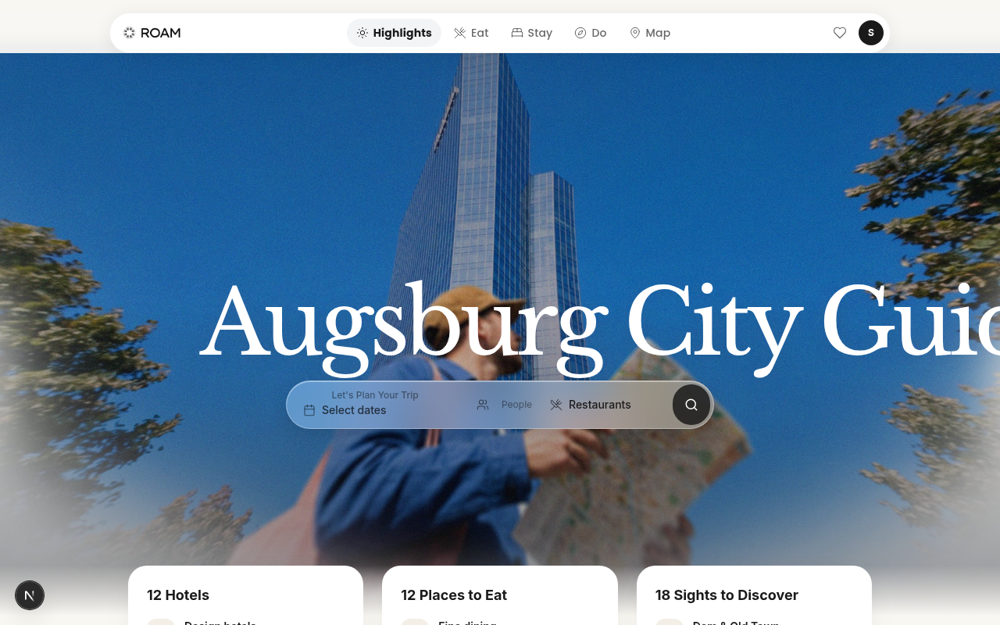
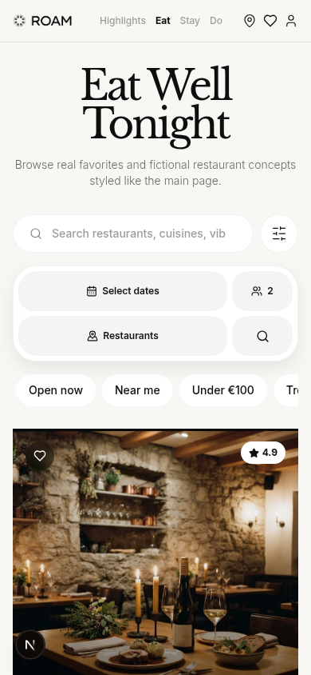
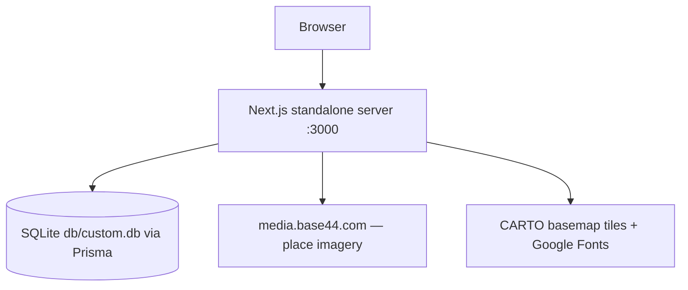

# ROAM — Augsburg City Guide


A production-grade, self-hosted clone of the reference trip-planning app at `activity-map.base44.app` — rebuilt as a single Next.js application with cookie-session auth, a full browse → detail → booking flow, an interactive map, and the 42 real places captured from the live app.

## Overview

The reference app is an Augsburg city guide: a photographic trip-planner home page, three category browses (Eat / Stay / Do) with search and measured filter chips, place detail pages with a booking card, a Leaflet map over the whole city, favourites, and a profile with trips and bookings — all behind an email/password login. This repo reproduces that experience end-to-end: same visual design tokens (measured from the live app), same filter semantics, same entity data, but running locally as a standalone Next.js 16 server with a Prisma/SQLite store and zero external services.

| Desktop home | Mobile browse |
|---|---|
|  |  |

Ten production captures live in [`docs/screenshots/`](docs/screenshots/): home, Eat, Stay, Do, map, place detail, favourites, profile, and two mobile views.

## Key Features

| Feature | Description |
|---------|-------------|
| 🧭 **Trip planner home** | Full-bleed Augsburg hero (Playfair Display wordmark over a legibility gradient) with a Where / Dates / Guests planner card that submits straight to the map |
| 🍽 **Eat / Stay / Do browses** | Server-rendered grids of the 42 captured places with live search and **data-measured filter chips** (eat: Open now / Near me / Under €100 / Trending + cuisine tags; stay & do: the entities' own tags) that AND-compose |
| 🏛 **Place detail + booking** | Gallery, description, rating, highlights, and a booking card with date/guest pickers — guests clamped server-side to `minParty`/`maxParty`, bookings visible on the profile |
| 🗺 **Interactive map** | Leaflet map with CARTO basemap, black dot markers (violet when active), category pills, live search, and popups linking into place pages |
| ❤️ **Favourites** | One-tap save/unsave on cards and detail pages, with a dedicated Favourites view and an illustrated empty state |
| 👤 **Profile** | Identity card with avatar, Trips / Bookings tabs, upcoming-stay badges |
| 🔐 **Cookie-session auth** | scrypt password hashing + HMAC-SHA256-signed stateless cookies, login rate limiting (10/IP/15 min), auth-gated route group with server-side redirects |
| 📱 **Mobile-first chrome** | Measured 390px top bar (text-only links, no-scrollbar safety valve) that becomes the floating white pill from `sm` up — regression-pinned by E2E against the five known Tailwind v4 mobile-nav failure classes |

## Architecture

| Layer | Technology | Version | Purpose |
|-------|-----------|---------|---------|
| Web framework | Next.js (App Router, standalone output) | 16 | Pages, API route handlers, server components |
| UI runtime | React | 19 | Server components by default; 11 client components |
| Language | TypeScript | 5 (strict, `noImplicitAny` off) | Type-safe app + typed API DTOs |
| Styling | Tailwind CSS | 4 (CSS-first, no config file) | `@theme` tokens + `@utility` primitives |
| Fonts | Playfair Display + Inter | — | Serif display + UI sans (Google Fonts) |
| Map | Leaflet + react-leaflet | 1.9 / 5 | Map view, `ssr:false` dynamic mount |
| ORM | Prisma | 6 | Schema, client, seed |
| Database | SQLite (PostgreSQL switchable) | — | Zero-config local store |
| Unit tests | Vitest | 5 | 32 checks on the pure seams |
| E2E tests | Playwright | 1.63 | 27 checks against the production build |
| Runtime | Bun (npm-compatible) | ≥1.4 | Install, dev, seed, server |



## File Hierarchy

```
📂 src/
 ┣ 📂 app/
 ┃ ┣ 📂 (app)/            ← auth-gated route group (layout redirects to /login)
 ┃ ┃ ┣ 📄 page.tsx        ← Home: hero + trip planner + category cards
 ┃ ┃ ┣ 📄 eat|stay|do/    ← Category browses (server components)
 ┃ ┃ ┣ 📄 place/[slug]/   ← Place detail
 ┃ ┃ ┣ 📄 map/ favourites/ profile/
 ┃ ┣ 📂 api/              ← health, auth/*, places, places/[slug], favourites, bookings
 ┃ ┣ 📄 login/            ← Real login route (public)
 ┃ ┣ 📄 globals.css       ← Tailwind v4 @theme tokens + @utility primitives
 ┃ ┗ 📄 layout.tsx        ← Root layout, fonts, metadata
 ┣ 📂 components/         ← Navbar, Hero, CategoryExplorer, PlaceCard, BookingForm,
 ┃                          MapExplorer + LeafletCanvas, FavouritesView, ProfileView, LoginForm
 ┣ 📂 lib/                ← auth, db, db-path, filters, places, rate-limit, utils (pure seams)
 ┗ 📂 types/              ← PlaceDTO / BookingDTO / PlaceCategory
📂 prisma/                ← schema.prisma, seed.ts, data/{eat,stay,do}.json (captured entities)
📂 tests/                 ← db-path + filters (Vitest), e2e/ (Playwright: auth, browse, mobile-nav)
📂 scripts/               ← smoke-test.sh (27-check API suite)
📂 docs/                  ← DEPLOYMENT.md, Tailwind-V4-Validation-Report.md, screenshots/, SSH push runbook
```

## Quick Start

Requires Bun ≥1.4 (or npm/node ≥20) .

1. Clone and install:

   ```bash
   git clone https://github.com/nordeim/activity-map.git
   cd activity-map
   bun install
   ```

2. Configure and seed the database:

   ```bash
   cp .env.example .env
   bun run db:push     # apply the schema (db/e2e-agnostic, no migrations folder)
   bun run db:seed     # 42 places + the demo user
   ```

3. Start the dev server:

   ```bash
   bun run dev
   ```

**Verify setup:** open `http://localhost:3000` → you land on the login card; sign in with `sepnetflix2023@outlook.com` / `$Abcd1234` → the Highlights page renders the Augsburg hero, the planner, and the three category cards.

## Environment Variables

| Variable | Required | Purpose |
|----------|----------|---------|
| `DATABASE_URL` | Yes | `file:../db/custom.db` (relative URLs resolve against `prisma/schema.prisma`) or a PostgreSQL string — see `.env.example` |
| `AUTH_SECRET` | **In production** | HMAC key for session cookies; generate with `openssl rand -hex 32` |
| `NEXT_PUBLIC_SITE_URL` | No | Reserved canonical-origin slot |

## Testing

| Layer | Command | Checks | Notes |
|-------|---------|--------|-------|
| Unit | `bun run test` | 32 | Vitest — db-path resolution contract + filter semantics |
| E2E | `bun run build && bun run test:e2e` | 27 | Playwright drives the production standalone server on :3100 with its own seeded DB |
| Smoke | `bun run build && ./scripts/smoke-test.sh` | 27 | Boots a fresh production server and exercises the whole API surface |

The full pre-push gate is `lint → typecheck → test → build → smoke → e2e` (see `AGENTS.md`).

## API Reference

| Endpoint | Method | Auth | Description |
|----------|--------|------|-------------|
| `/api/health` | GET | — | Liveness probe |
| `/api/auth/login` | POST | — | Credential check → session cookie (rate-limited: 10/IP/15 min) |
| `/api/auth/logout` | POST | ✔ | Clears the session |
| `/api/auth/me` | GET | ✔ | Current session payload |
| `/api/places` | GET | ✔ | Places with per-user `saved` flags (`?category=eat\|stay\|do`) |
| `/api/places/[slug]` | GET | ✔ | One place |
| `/api/favourites` | GET / POST / DELETE | ✔ | List / save / unsave |
| `/api/bookings` | GET / POST | ✔ | List / create (guests clamped server-side) |

All responses use the envelope `{ ok: true, data } | { ok: false, error }`.

## Design System

| Token | Hex | Usage |
|-------|-----|-------|
| `--color-cream` | `#F9F7F2` | Page canvas |
| `--color-cream-deep` | `#F3EFE7` | Raised cream surfaces |
| `--color-ink` | `#1A1A1A` | Primary text, black buttons, map markers |
| `--color-roam` | `#5A18FB` | VIEW ALL accent, active map marker, selection |
| `--color-roam-deep` | `#4A0FE0` | Accent hover/pressed |

Typography: **Playfair Display** (serif display — hero wordmark, view headlines) + **Inter** (UI sans), both via `next/font`/Google Fonts. Motion respects `prefers-reduced-motion`. Map markers are 16px black dots with a white ring (22px violet when active); popups follow the app's radius scale.

## Deployment

Single-process standalone build + SQLite — no Docker or external services required. Full guide (absolute `DATABASE_URL`, reverse proxy, updating, troubleshooting): [`docs/DEPLOYMENT.md`](docs/DEPLOYMENT.md).

```bash
bun run build
bun run start        # NODE_ENV=production bun .next/standalone/server.js
```

## Project Status

| Phase | Status | Key Deliverables |
|-------|--------|------------------|
| Reference analysis | ✅ Complete | Live app explored; entity data captured (12 eat / 12 stay / 18 do); design tokens measured |
| Application build | ✅ Complete | Full route group, API surface, Leaflet map, auth, seed |
| Mobile navigation fix | ✅ Complete | Tailwind v4 failure classes addressed + E2E-pinned (5 classes, 8 checks) |
| Verification | ✅ Complete | lint ✓ typecheck ✓ 32 unit ✓ 27 E2E ✓ 27 smoke ✓ |
| Documentation | ✅ Complete | AGENTS.md, CLAUDE.md, README.md, Project_Architecture_Document.md, 10 screenshots |

## Troubleshooting

| Symptom | Cause | Fix |
|---------|-------|-----|
| `Error code 14: Unable to open the database file` | Server started outside the repo, or a stray parent `.env` injected an absolute `DATABASE_URL` | Start via `bun run start` / `bun run dev` (both pin the URL); set an absolute `file:` URL in production |
| Standalone server uses the wrong database after a rebuild | Turbopack's production minifier mis-compiles multi-return path helpers | Already mitigated — `src/lib/db-path.ts` uses single-exit forms; keep them that way |
| Login rejected with 429 | Rate limiter (10 attempts/IP/15 min) | Wait for `Retry-After` or restart the process (in-memory buckets) |
| Logins loop back to `/login` after a restart | `AUTH_SECRET` changed between restarts | Keep the secret stable |

## Contributing

- TDD where a pure seam is involved: extend `tests/*.test.ts` first (RED), implement (GREEN), refactor.
- Tailwind v4: CSS-first — add tokens to `@theme` in `src/app/globals.css`, never a `tailwind.config.*` file.
- React 19: no `forwardRef`; server components by default.
- Conventional Commits, `main` only, push via `docs/ssh_git_wrapper_v3.py` (runbook in `docs/how-to-git-push-using-ssh-wrapper_SKILL.md`).
