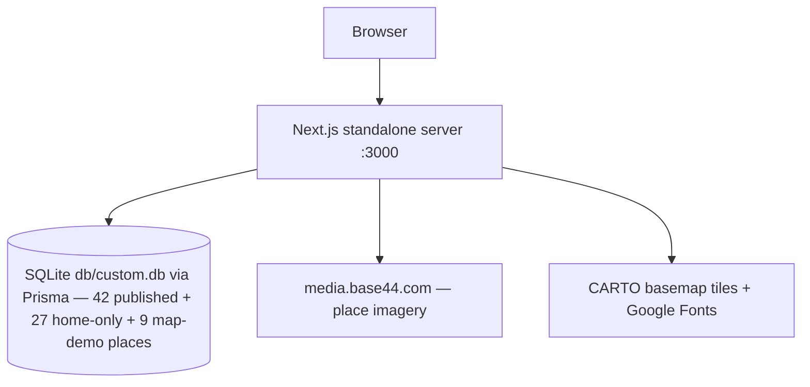

# ROAM — Augsburg City Guide


A production-grade, self-hosted clone of the reference trip-planning app at `activity-map.base44.app` — rebuilt as a single Next.js application with cookie-session auth, a full browse → detail → booking flow, an interactive map, and the 42 real places captured from the live app.

## Overview

The reference app is an Augsburg city guide: a photographic hero with a frosted glass trip-planner pill (hover-revealed labels, a react-day-picker-style date-range popover, and a search that routes into the category browses with `people`/`start_date`/`end_date` params), glass category cards, the scroll-driven **Recommended Route** itinerary, a blue **Highlighted Restaurants** band with a featured card and restaurant strip, the full **Choose Your Vibe** stay showcase, the **Highlighted Sights** grid, three category browses (Eat / Stay / Do) with search, measured filter chips, and a sticky white planner pill, redesigned place detail pages with a booking-request form, a Leaflet map over the whole city (9 demo places, as on the live app), favourites, and a redesigned profile with trips and bookings — all behind an email/password login. This repo reproduces that experience end-to-end: same visual design tokens (re-measured session 3: cream `#F8F7F4`, ink `#0E0E0E`, violet `#571AFF`, Libre Baskerville display serif + Inter for UI and nav), same filter semantics, same entity data, but running locally as a standalone Next.js 16 server with a Prisma/SQLite store and zero external services.

| Desktop home | Mobile browse |
|---|---|
|  |  |

Fourteen production captures live in [`docs/screenshots/`](docs/screenshots/): home, the four new home sections (route, restaurants, stays, sights), Eat, Stay, Do, map, place detail, favourites, profile, and two mobile views.

## Key Features

| Feature | Description |
|---------|-------------|
| 🧭 **Home, re-measured + remediated (sessions 3 + 6 + 10)** | Taller traveller-photo hero (session-10 live geometry: 591px phones / 900px-md / 938px-lg, the photo sliding under the transparent sticky header at md) with the huge Libre Baskerville wordmark at the live's measured positions (h1 y≈203 mobile / y≈290 desktop, the 126px mobile planner gap), the white elevated PLANNER CARD below md (radius 30, gray field pills, "Let's Plan Your Trip"; the frosted glass pill from md), and the THREE GLASS CATEGORY CARDS riding the photo's bottom edge (session-10: radius 20, 28×28 glass icon cells, 12px/500 two-line rows) — a horizontal SNAP CAROUSEL of 306px cards on phones and the centered 263px card row from md with full-width VIEW ALL pills (violet h-9 mobile / near-black h-[54px] desktop) |
| 🗓 **Recommended Route** | The scroll-driven itinerary — 140vh heading trap, sticky route visual with a scroll-synced progress pill ("0% of your day planned"); below lg the five TEXT stop cards (session-8 live parity: white time pill + dark serif 44px title + white info card with inline meta + black Learn More) flow down a dashed timeline, from lg a 420vh trap pins the visual and swaps ONE 576px card at a time — the cards pin early, matching the live's ~2400px swap runway |
| 💙 **Highlighted Restaurants** | The vivid blue band (`#4D61FF`): desktop = a scroll-driven carousel over a 460vh trap (restaurant-name watermark, tilted floating photos, one frosted-glass detail card with Book a Table / Learn More); mobile = a sticky-stacked SIX-card deck (session-8 live parity — the first six restaurants) sliding over each other |
| 🛏 **Choose Your Vibe** | The full twelve-stay showcase (session-12 order: the live's shuffled home sequence — Courtyard Stay first, browse order untouched) as SQUARE photo cards (aspect 1/1, radius 24, white Inter 18px dsk / 24px mob titles overlaid, "€€€ · ★ rating" meta, ghost Learn More + white Book Now pills) — session-14: the grid fills COLUMN-MAJOR from md (`grid-rows-4 + grid-flow-col` — the live's 3 columns × 4 stacked cards, so visual row 1 reads Courtyard | Maison | Velvet) over the bare 1178px grid (no container padding) at an 18px gap → 381px cards, under the big serif heading — session-12: FULL-WIDTH LEFT-ALIGNED at #1A1A1A with the live's per-letter scroll reveal (cream → ink, LetterReveal) and the 14px #8A8780 centered subtitle |
| 🏛 **Highlighted Sights** | Six calm stops (Fuggerei → Schaezlerpalais) as square photo cards with white overlaid titles (24px mob / 18px dsk), in-card meta overlays, heart + rating pills, and the dark More Things to Do hand-off (session-8) |
| 🔍 **Trip planner (shared + browse)** | `TripPlanner` + `DateRangePicker` (Su–Sa popover, from/to optional, `DD/MM/YYYY — DD/MM/YYYY`): the home hero's search routes to `/eat|/stay|/do?people=N&start_date=…&end_date=…` (Hotels → `/stay`, Attractions → `/do`); the browse pages render the unified `BrowsePlanner` (session-8) — inline search + labelled date/people fields that AUTO-FORWARD the params back to the same browse — pure helpers unit-tested in `src/lib/planner.ts` |
| 🍽 **Eat / Stay / Do browses** | Server-rendered grids of the 42 captured places with live search and **data-measured filter chips** (session-12: compact 38px/12px pills; eat: Open now / Near me / Under €100 / Trending + cuisine tags; stay & do: the entities' own tags) that AND-compose, under the unified browse planner (session-8: one white card on phones / one sticky white pill from md — inline search + labelled date/people fields that auto-forward + two circular icon actions). Session-14: the heading block matches the live's measured geometry — the page runs `px-5 pt-16 md:px-8 md:pt-24` (h1 y≈168) with the heading in a full-width max-w-7xl block and the subtitle 14px #3A3A3A. Cards re-measured session 3: eat/do names overlaid on 300px-mob/372px-dsk photos (28px Inter, tracking −0.04em) with tag pills, violet `#571AFF` Learn More, and ACTIVE+DIMMED price symbols; stay cards are dark `aspect-square` composites with ghost Learn More + white Book Now on hover; date-range params filter the grids |
| 🏛 **Place detail + booking request** | 50.7px-mobile→82px-desktop h1 (session-6 scale), "About this place" (34px, session-8) + tag pills, gallery, rating (session-8: the white rating pill rides the hero photo's top-right corner — no Map button; 260px-mob/420px-md/460px-lg photo; session-10: ONE wide white card `max-w-6xl` rounded-36, shadow-only, no border; session-14: the card's inner padding p-6 → md:p-10 with the ≈56/44 content/form column split), highlights, and the booking-request form (Name*, Surname*, Dates, Time, Phone, Email*, Message → `Book Now` violet 48px) posting to `/api/bookings` — session-14: the form card is a plain white rounded-28 with the black/8 hairline (no shadow), leads with the 18px "Book Now" heading + the 14px #888580 request subtitle, and renders SINGLE-COLUMN 44px fields; request fields persisted on the `Booking` model and bookings visible on the profile |
| 🗺 **Interactive map** | Leaflet map with CARTO basemap fed by the 9 demo places the live app hardcodes (status `"map"`, real lat/lng, `map-*` slugs): black dot markers (violet when active), the session-12 chrome — the FULL-WIDTH cream search pill (max-w 1138, border black/5) with the violet icon cell + round filters button, 41px/12px category pills WITH icons (violet-tinted active), circular zoom controls, the 620px desktop canvas, bottom stats pills (Augsburg center / N places / € pricing), geolocation notice with Augsburg fallback, "Places on the map" list section (session-16: FOUR-row TEXT-ONLY white cards — radius 24, black/8 hairline, no photos — with the eyebrow + €-price on ONE justified row, the 15px/600 title, and the 12px #888580 neighborhood line; the do-places carry their SUB-CATEGORY as the eyebrow — LANTERN WALK / ROOFTOP MUSIC / ART WORKSHOP — and the list follows the live's interleaved order: Brass & Marble first), live search, and popups linking into place pages |
| ❤️ **Favourites** | One-tap save/unsave on cards and detail pages (the 44×44 dark-glass heart, session-10), with a dedicated Favourites view (session-12: the 18px graph-paper grid texture at 40% opacity — session-14: scoped INSIDE the overflow-hidden heading section (the live's texture covers the heading block only), 55px serif heading riding the pt-16/md:pt-24 block (h1 y≈244), the 14px #3A3A3A subtitle, the live's Inter empty state) and an illustrated empty state |
| 👤 **Profile** | Session-16: a CHROME-LESS page (the `(bare)` route group — no navbar at any breakpoint, no footer, exactly like the live) carrying a FULL-PAGE fixed 18px graph-paper grid overlay at 40% opacity, the outer block `px-5 pb-24 pt-10 md:px-8 md:pt-16` with the main at max-w-4xl, and the translucent white/80 Go back + Sign out pills at the top. TWO glass cards (896px): the identity card (rounded-36, bg-white/78, border-white/70, CENTERED on phones / left from md) with the Profile eyebrow, the account identity as the h1 (session-14: the USERNAME "sepnetflix2023" — 72px serif) with the EMAIL as the 16px #555550 line, the cream outlined Augsburg / sun-icon 0-day-streak / heart-icon Explorer chips, and the dark heart Saved-places button into /favourites; the bookings card (rounded-32, mt-8) with the Trips eyebrow, the 36px "My bookings" h2 + total count, FULL-WIDTH 44px/12px Upcoming/Past tabs, 38px All/Eat/Stay/Do filters, and the white rounded-26 empty state |
| 📄 **Legal pages** | Privacy policy and Accessibility Statement (the footer's measured links), rendered as real public routes — and the white icon-cell footer pill renders on EVERY app page (session-6 live parity) |
| 🔐 **Cookie-session auth** | scrypt password hashing + HMAC-SHA256-signed stateless cookies, login rate limiting (10/IP/15 min), auth-gated route group with server-side redirects, and the live-parity login card (session-10: a plain white page — session-12: the document body pinned white too — with the shadcn-style card, the circular logo disc, system-font heading, Mail/Lock input icons, and the slate-900 `#0F172A` Sign-in button; the Google/forgot/signup flows answer with inline notices) |
| 📱 **Mobile-first chrome** | Measured 390px fixed-top cream-glass tab-bar (52px, ≤430px centered, text-only 12px Inter links — active 700/`#0E0E0E`, inactive 500/40%, three 18px right icons: MapPin/Heart/User; the home hero slides under the glass). Session-16: the mobile home planner card escapes the px-6 hero content — 358px wide at x=16 with a 4px grid gap (the live's measured geometry) that becomes the sticky transparent header wrapping the centered WHITE floating PILL (h-14, max-w 820, radius 999, 1px `#E8E6DC` border, soft shadow, 13px icon+text links with the active link 700 on the `rgba(14,14,14,0.08)` pill, heart + black avatar disc right cluster, hide-on-scroll choreography) from `md` up — regression-pinned by E2E against the five known Tailwind v4 mobile-nav failure classes |

## Architecture

| Layer | Technology | Version | Purpose |
|-------|-----------|---------|---------|
| Web framework | Next.js (App Router, standalone output) | 16 | Pages, API route handlers, server components |
| UI runtime | React | 19 | Server components by default; 18 client components |
| Language | TypeScript | 5 (strict, `noImplicitAny` off) | Type-safe app + typed API DTOs |
| Styling | Tailwind CSS | 4 (CSS-first, no config file) | `@theme` tokens + `@utility` primitives |
| Fonts | Libre Baskerville + Inter | — | Serif display + UI/nav sans (Google Fonts; Poppins was removed by the live app's session-3 redesign — `.font-poppins` now maps to the serif) |
| Map | Leaflet + react-leaflet | 1.9 / 5 | Map view, `ssr:false` dynamic mount |
| ORM | Prisma | 6 | Schema, client, seed |
| Database | SQLite (PostgreSQL switchable) | — | Zero-config local store |
| Unit tests | Vitest | 5 | 42 checks on the pure seams |
| E2E tests | Playwright | 1.63 | 52 checks against the production build |
| Runtime | Bun (npm-compatible) | ≥1.4 | Install, dev, seed, server |



## File Hierarchy

```
📂 src/
 ┣ 📂 app/
 ┃ ┣ 📂 (app)/            ← auth-gated route group (layout redirects to /login)
 ┃ ┃ ┣ 📄 page.tsx        ← Home: hero + planner + category cards + Recommended Route
                             + blue restaurants + stay showcase + sights + footer
 ┃ ┃ ┣ 📄 eat|stay|do/    ← Category browses (server components, searchParams-aware)
 ┃ ┃ ┣ 📄 place/[slug]/   ← Place detail + booking-request form
 ┃ ┃ ┣ 📄 map/ favourites/ profile/
 ┃ ┣ 📂 api/              ← health, auth/*, places, places/[slug], favourites, bookings
 ┃ ┣ 📄 login/            ← Real login route (public)
 📃 privacy/ accessibility/ ← Public legal pages (the footer's measured links)
 ┃ ┣ 📄 globals.css       ← Tailwind v4 @theme tokens + @utility primitives
 ┃ ┗ 📄 layout.tsx        ← Root layout, fonts, metadata
 ┣ 📂 components/         ← Navbar + SiteFooter + LegalPage, Hero, CategoryCards,
                          RecommendedRoute (sticky scroll), HighlightedRestaurants,
                          StayShowcase, HighlightedSights, CategoryExplorer, PlaceCard,
                          StayCard, planner/ (TripPlanner + DateRangePicker), BookingForm,
                          MapExplorer + LeafletCanvas, FavouritesView, ProfileView, LoginForm
 ┣ 📂 lib/                ← auth, db, db-path, filters, planner, places
                          (listHomePlaces + listMapPlaces), rate-limit, utils
 ┗ 📂 types/              ← PlaceDTO / BookingDTO / PlaceCategory
📂 prisma/                ← schema.prisma, seed.ts, data/{eat,stay,do,home,map}.json
                              (captured entities + home-only showcase rows + 9 map-demo places)
📂 tests/                 ← db-path + filters (Vitest), e2e/ (Playwright: auth, browse, home parity, mobile-nav)
📂 scripts/               ← smoke-test.sh (27-check API suite)
📂 docs/                  ← DEPLOYMENT.md, remediation-plan.md, Tailwind-V4-Validation-Report.md,
                              screenshots/ (14 captures), SSH push runbook
```

## Quick Start

Requires Bun ≥1.4 (or npm/node ≥20) .

1. Clone and install:

   ```bash
   git clone https://github.com/nordeim/activity-map.git
   cd activity-map
   bun install
   ```

2. Configure and seed the database:

   ```bash
   cp .env.example .env
   bun run db:push     # apply the schema (db/e2e-agnostic, no migrations folder)
   bun run db:seed     # 78 places (42 published + 27 home-only + 9 map-demo) + the demo user
   ```

3. Start the dev server:

   ```bash
   bun run dev
   ```

**Verify setup:** open `http://localhost:3000` → you land on the login card; sign in with `sepnetflix2023@outlook.com` / `$Abcd1234` → the Highlights page renders the traveller-photo hero, the glass planner (pick dates in the popover, then Search → `/eat?people=…&start_date=…`), the glass category cards, and the full home showcase (sticky route, restaurants, stays, sights).

## Environment Variables

| Variable | Required | Purpose |
|----------|----------|---------|
| `DATABASE_URL` | Yes | `file:../db/custom.db` (relative URLs resolve against `prisma/schema.prisma`) or a PostgreSQL string — see `.env.example` |
| `AUTH_SECRET` | **In production** | HMAC key for session cookies; generate with `openssl rand -hex 32` |
| `NEXT_PUBLIC_SITE_URL` | No | Reserved canonical-origin slot |

## Testing

| Layer | Command | Checks | Notes |
|-------|---------|--------|-------|
| Unit | `bun run test` | 42 | Vitest — db-path resolution contract, filter semantics, and planner param/date-label helpers |
| E2E | `bun run build && bun run test:e2e` | 56 | Playwright drives the production standalone server on :3100 with its own seeded DB |
| Smoke | `bun run build && ./scripts/smoke-test.sh` | 27 | Boots a fresh production server and exercises the whole API surface |

The full pre-push gate is `lint → typecheck → test → build → smoke → e2e` (see `AGENTS.md`).

## API Reference

| Endpoint | Method | Auth | Description |
|----------|--------|------|-------------|
| `/api/health` | GET | — | Liveness probe |
| `/api/auth/login` | POST | — | Credential check → session cookie (rate-limited: 10/IP/15 min) |
| `/api/auth/logout` | POST | ✔ | Clears the session |
| `/api/auth/me` | GET | ✔ | Current session payload |
| `/api/places` | GET | ✔ | Places with per-user `saved` flags (`?category=eat\|stay\|do`) |
| `/api/places/[slug]` | GET | ✔ | One place |
| `/api/favourites` | GET / POST / DELETE | ✔ | List / save / unsave |
| `/api/bookings` | GET / POST | ✔ | List / create (guests clamped server-side) |

All responses use the envelope `{ ok: true, data } | { ok: false, error }`.

## Design System

Re-measured from the live app session 3 (`src/app/globals.css` `@theme`):

| Token | Hex | Usage |
|-------|-----|-------|
| `--color-cream` | `#F8F7F4` | Page canvas (footer matches) |
| `--color-cream-deep` / `--color-surface2` | `#F2F1EE` | Raised cream surfaces, tag pills |
| `--color-ink` | `#0E0E0E` | Primary text, black buttons, map markers |
| `--color-secondary` | `#3A3A3A` | Body copy |
| `--color-muted` | `#888580` | Muted meta text |
| `--color-line` | `#E8E6DC` | Navbar bottom border |
| `--color-border` | `#DDDBD5` | Card hairlines |
| `--color-roam` | `#571AFF` | Learn More / Book Now accent, active map marker, selection |
| `--color-roam-deep` | `#4A0FE0` | Accent hover/pressed |
| `--color-electric` | `#4D61FF` | The home "Highlighted Restaurants" blue band |

Typography: **Libre Baskerville** (serif display — every h1/h2, with per-section `clamp()` scales measured at 1280/768/390) + **Inter** (UI sans AND nav links — the live app dropped Poppins in its session-3 redesign; the legacy `.font-poppins` utility now maps to Libre Baskerville), all via Google Fonts. VIEW ALL pills are near-black `#141413` on the glass category cards. Motion respects `prefers-reduced-motion`. Map markers are 16px black dots with a white ring (22px violet when active); popups follow the app's radius scale.

## Deployment

Single-process standalone build + SQLite — no Docker or external services required. Full guide (absolute `DATABASE_URL`, reverse proxy, updating, troubleshooting): [`docs/DEPLOYMENT.md`](docs/DEPLOYMENT.md).

```bash
bun run build
bun run start        # NODE_ENV=production bun .next/standalone/server.js
```

## Project Status

| Phase | Status | Key Deliverables |
|-------|--------|------------------|
| Reference analysis | ✅ Complete | Live app explored; entity data captured (12 eat / 12 stay / 18 do); design tokens measured |
| Application build | ✅ Complete | Full route group, API surface, Leaflet map, auth, seed |
| Mobile navigation fix | ✅ Complete | Tailwind v4 failure classes addressed + E2E-pinned (5 classes, 8 checks) |
| Verification | ✅ Complete | lint ✓ typecheck ✓ 42 unit ✓ 54 E2E ✓ 27 smoke ✓ (session-12 gates) |
| Documentation | ✅ Complete | AGENTS.md, CLAUDE.md, README.md, Project_Architecture_Document.md, 14 screenshots |
| Session 2 remediation | ✅ Complete | Live-app parity pass — fonts/logo/hero, home showcase (route, blue restaurants, stays, sights, footer, legal pages), env pinning; gates re-verified (32 unit · 27 smoke · 35 E2E) |
| Session 3 remediation | ✅ Complete | Live-app re-measure (14 findings, `docs/remediation-plan-session-3.md`): tokens `#F8F7F4/#0E0E0E/#571AFF`, Poppins→Inter nav, flat-white desktop navbar + cream-glass mobile tab-bar, TripPlanner + DateRangePicker routing into browses, redesigned eat/do/stay cards, sticky-route redesign, booking-request form + schema fields, 9 demo map places, profile redesign; gates re-verified (42 unit · 27 smoke · 35 E2E) |
| Session 4 recovery | ✅ Complete | Interrupted-hand-off repair (`docs/remediation-plan-session-4.md`): restored the deleted `(app)` route-group layout (auth gate + Navbar), home page, and `/api/auth/login` route (orphaned duplicate at `/api/auth` removed); live-app parity re-verified (mobile 390px chrome matches reference); 14 screenshots refreshed; all gates green (42 unit · 27 smoke · 35 E2E) |
| Session 6 redesign parity | ✅ Complete | Live-app re-measure (`docs/remediation-plan-session-6.md`, findings F1–F14): desktop floating-pill navbar (13px links), mobile 12px nav links + white planner card, violet mobile VIEW ALL, pinned route card-swap with photo stops + black Learn More, blue restaurants carousel (desktop) + sticky card deck (mobile), square stay/sight cards with overlaid white Inter titles, icon-cell footer pill on every page, 50.7px typography scale, profile h1 = username, live-parity login chrome; hero wordmark clipping fixed; gates green (42 unit · 27 smoke · 45 E2E) |
| Session 8 evolution parity | ✅ Complete | Live-app re-measure (`docs/remediation-plan-session-8.md`, findings F1–F13): text-only route stop cards (photos removed) + early-pinned 576px swap over a 420vh trap, six-card mobile restaurant deck, per-letter scroll reveal on the Choose Your Vibe heading, 24px mobile stay/sight titles, dark More Things to Do pill, unified browse planner (card/pill with inline search + labelled fields + icon actions, auto-forward params), detail rating pill on the photo + 34px About + 260px mobile photo, 300px mobile browse photos, profile back/email/saved-button/icons, violet-tinted map pills + cream search + circular zoom + bottom stats; gates green (42 unit · 27 smoke · 52 E2E) |
| Session 10 residual-gap parity | ✅ Complete | Deep re-measure (`docs/remediation-plan-session-10.md`, findings F1–F9): category cards rebuilt to the live internals (263px glass cards, 28×28 glass icon cells, 12px/500 two-line rows, live icon set incl. Wine/Coffee/Palette/FerrisWheel, full-width 54px View All) + a mobile horizontal SNAP CAROUSEL (306px cards, scrollWidth 982); hero re-geometried to the live's measured positions (591/900/938px photo sliding under the transparent header, h1 y≈203/290, 126px mobile planner gap, cards flush with the photo bottom); login redesigned to the live's shadcn chrome (plain white page, circular logo disc, system-font heading, Mail/Lock input icons, slate-900 button, bottom forgot/signup row); favourites de-gridded (55px/0.92/−0.06em h1, Inter 20px/600 empty state); detail page widened to one max-w-6xl rounded-36 shadow-only card with the 420px-md/460px-lg photo tiers; profile Saved-places heart button; 44×44 heart overlays; route stops as h2; gates green (42 unit · 27 smoke · **54 E2E**) |
| Session 12 evolution parity | ✅ Complete | Live re-measure (`docs/remediation-plan-session-12.md`, findings F1–F9): the home stay showcase re-ordered to the live's shuffled sequence (Courtyard Stay first — the /stay browse order untouched); the profile redesigned into TWO glass cards (the account NAME "Explorer" as the 72px h1, "Your Roam account", full-width 44px/12px tabs, 38px filters, the white rounded-26 empty state); the map chrome widened (full-width 1138px bordered search, 41px/12px pills, 620px desktop canvas); the vibe heading went full-width left-aligned #1A1A1A with the 14px #8A8780 subtitle and the 1178px grid; the favourites grid texture restored (18px crossings, 40% opacity) with the 14px #3A3A3A subtitle; the login body pinned white (unlayered-rule workaround); browse chips compacted 38px/12px; category cards compacted 248px; gates green (42 unit · 27 smoke · **54 E2E**) |
| Session 14 deployed-mirror parity | ✅ Complete | The deployed mirror came back UP — first session to run browser E2E against `activity-map.jesspete.shop` (mobile nav + all pages verified, save round-trip E2E-proven) AND diff it against the live source (`docs/remediation-plan-session-14.md`, findings F1–F11): the profile identity re-rendered (USERNAME h1 + EMAIL line — the seed user renamed); the vibe stay grid switched to the live's COLUMN-major flow (381px cards, 18px gap, bare 1178 grid); the map list cards went TEXT-ONLY (radius 24, no photos); the browse/map heading block re-geometried (px-5/pt-16 → md:px-8/md:pt-24, max-w-7xl, 14px #3A3A3A subtitle); the booking form rebuilt (Book Now 18px heading, 14px #888580 request line, single-column 44px fields, hairline-only card, ≈56/44 detail split); the favourites overlay scoped to the heading section; the hero px-6; the sights grid 1120px; observed live-site bug: the hosted app's SavedPlace POST 403s; gates green (42 unit · 27 smoke · **54 E2E**) |
| Session 16 profile/map parity | ✅ Complete | Dual-site browser audit (`docs/remediation-plan-session-16.md`, findings F1–F11): the profile rebuilt as the live's CHROME-LESS page (the `(bare)` route group — no navbar/footer — with the full-page fixed 18px grid overlay, the live's outer geometry px-5/pt-10 → md:px-8/md:pt-16 + max-w-4xl main, centered-mobile identity, sun/heart chip icons, the Go back/Sign out white/80 pills); the map list cards rebuilt to the live's FOUR-row layout (eyebrow + price on one justified row, title, neighborhood line; do-places eyebrow = sub-category uppercase; the live's interleaved order — Brass & Marble first); the mobile planner card widened to 358px at x=16 (gap 4px); the category cards re-measured (desktop 46px rows + 34×35 icon cells + the View All hanging below the glass; mobile radius 24); gates green (42 unit · 27 smoke · **56 E2E**) |

## Troubleshooting

| Symptom | Cause | Fix |
|---------|-------|-----|
| `Error code 14: Unable to open the database file` | Server started outside the repo, or a stray parent `.env` injected an absolute `DATABASE_URL` | Start via `bun run start` / `bun run dev` (both pin the URL); set an absolute `file:` URL in production |
| Standalone server uses the wrong database after a rebuild | Turbopack's production minifier mis-compiles multi-return path helpers | Already mitigated — `src/lib/db-path.ts` uses single-exit forms; keep them that way |
| Login rejected with 429 | Rate limiter (10 attempts/IP/15 min) | Wait for `Retry-After` or restart the process (in-memory buckets) |
| Logins loop back to `/login` after a restart | `AUTH_SECRET` changed between restarts | Keep the secret stable |

## Contributing

- TDD where a pure seam is involved: extend `tests/*.test.ts` first (RED), implement (GREEN), refactor.
- Tailwind v4: CSS-first — add tokens to `@theme` in `src/app/globals.css`, never a `tailwind.config.*` file.
- React 19: no `forwardRef`; server components by default.
- Conventional Commits, `main` only, push via `docs/ssh_git_wrapper_v3.py` (runbook in `docs/how-to-git-push-using-ssh-wrapper_SKILL.md`).
